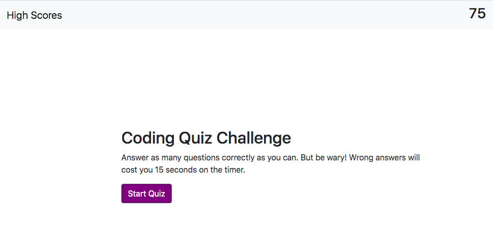
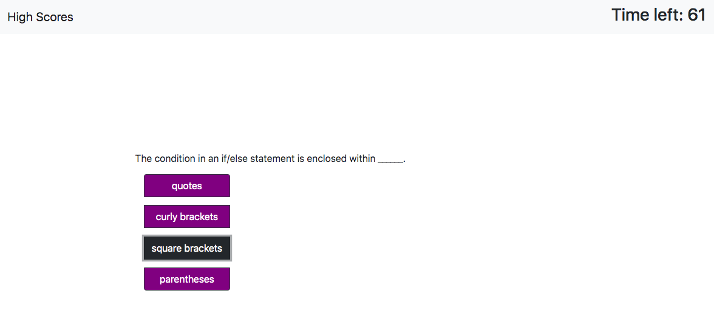

# code-quiz

## Objective
Create an interactive quiz that records the user's input and calculates a score. The user's score should then be recorded and displayed on a high-score page.

## Links

- [GitHub-Page](https://codybonsma.github.io/code-quiz/)
- [Local-Page](file:///Users/codybonsma/gt-ft/homework/code-quiz/index.html)

## Task List (work in progress)

* Finding a way to link my event delegation function to different quiz pages and answers

* Showing the user if their answer was correct or false 

* Storing their initials and score onto localStorage and displaying it back on a high-score page 

## Screenshot 
Loading page 

Question example
